# Final Fantasy Seven: 7th Heaven (Steam Deck Install Guide)

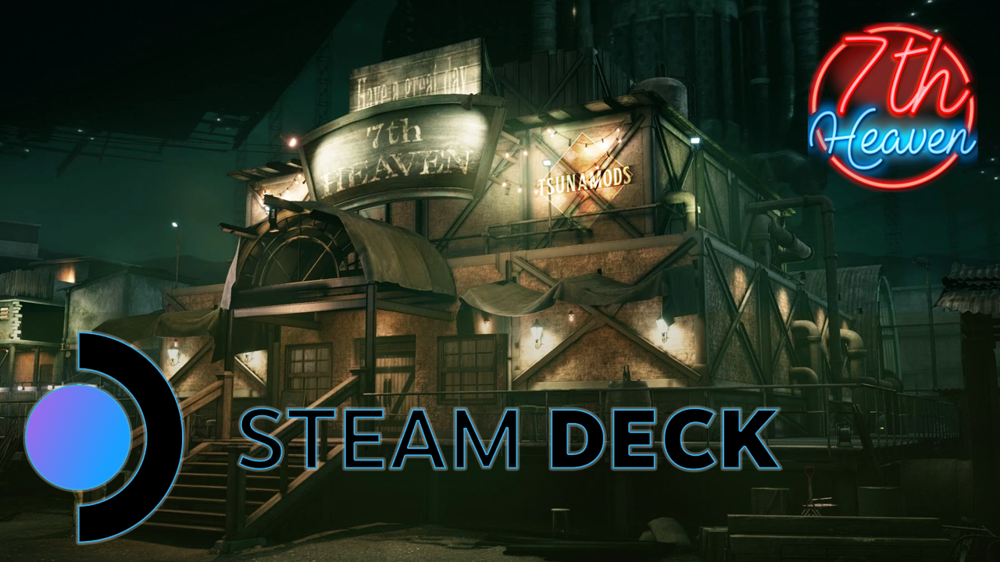


This guide serves as a walkthrough on how you can get the [7th Heaven mod](https://7thheaven.rocks/) for Final Fantasy 7 up and running on the [Steam Deck](https://store.steampowered.com/steamdeck).

  

[Video Proof](https://youtu.be/quRb4NeWTGs)

*Everything provided here is as is.*

I am not affiliated with any of the related IP. A lot of smart people brought us 7th Heaven and this is just meant to illustrate how to get it working for steam deck and snapshot a config that I know works end to end.

## Requirements

This guide assumes that you have the Steam version of Final Fantasy 7. It might work for other versions but I am going to assume you have downloaded it through the Steam Store

Go ahead and make sure you have downloaded/installed the following resources as we will need them later:

- A valid copy of Final Fantasy 7

	- [Installed from the Steam store](https://store.steampowered.com/app/39140/FINAL_FANTASY_VII/)

- [Bottles](https://usebottles.com/)

  - Discover store > `Bottles`

	- Alternatively you can type this to install through flatpak

	-  `flatpak install flathub com.usebottles.bottles`

- [Flatseal](https://flathub.org/apps/details/com.github.tchx84.Flatseal)

	- Discover Store > `FlatSeal`

	- Alternatively you can type this to install through flatpak

		-  `flatpak install flathub com.github.tchx84.Flatseal`

- [Full ZIP](https://github.com/auntiepickle/ff7seventhheavensteamdeck/archive/refs/heads/main.zip) (or you can download the components manually)

	- [7th Heaven mod](https://github.com/tsunamods-codes/7th-Heaven)

		- 7th Heaven GitHub > [Latest Release](https://github.com/tsunamods-codes/7th-Heaven/releases/latest)

	- [Custom 7th Heaven Recipe](https://github.com/auntiepickle/ff7seventhheavensteamdeck/blob/main/ff7heavensd.yml)

- [FFNx Release](https://github.com/julianxhokaxhiu/FFNx/releases)

	- At the time of writing, I am [using v1.14](https://github.com/julianxhokaxhiu/FFNx/releases/tag/1.14.0)

I personally extract the ZIP to my `~/Downloads` folder, which is how I replicated this process successfully many times so you can avoid a world of pain :)

## Walkthrough

With all the necessary components installed and downloaded lets begin by getting `Bottles` set up.

### FlatSeal

In order to give access to your Steam libraries, we need to use `Flatseal` to manage permissions of `Bottles`.

  

Using `Flatseal`, we can modify the permissions of any `flatpak` installed on our steam deck -- We'll need to modify our `Bottles` permissions in order to get the 7th Heaven installer running properly.

  

- Launch **Flatseal**

- Select **Bottles**

	- On the left hand side, you will see a list of all flatpaks installed on your system. Scroll through that list until you find `Bottles` and select it.

- Go to **Filesystem**

	- Scroll through the right-hand list of options until you see the `Filesystem` category.

This is where we will configure which files and folders `Bottles` has access to.

- Use the **Other Files** toggle

- Expose the following locations:

	- The location where you downloaded/stored all the config files:

		-  `~/Downloads`

	- Your Steamapps or Final Fantasy VII install directory:

		-  **Internal memory**: `~/.local/share/Steam/steamapps`

			- or

		- SD card: `/run/media/mmcblk0p1/steamapps/`

  

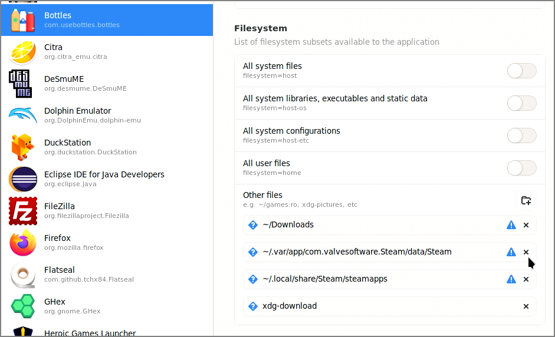
  

### Getting the right Runners and DLL Components

There are a bunch of [known issues with the latest versions of proton and 7th Heaven](https://github.com/tsunamods-codes/7th-Heaven/issues/19), hopefully this gets fixed in the future but because there are a host of issues and we need a specific configuration to get this working.

  

On the Bottles home page, hit the hamburger menu in the top right > Preferences > Runner

 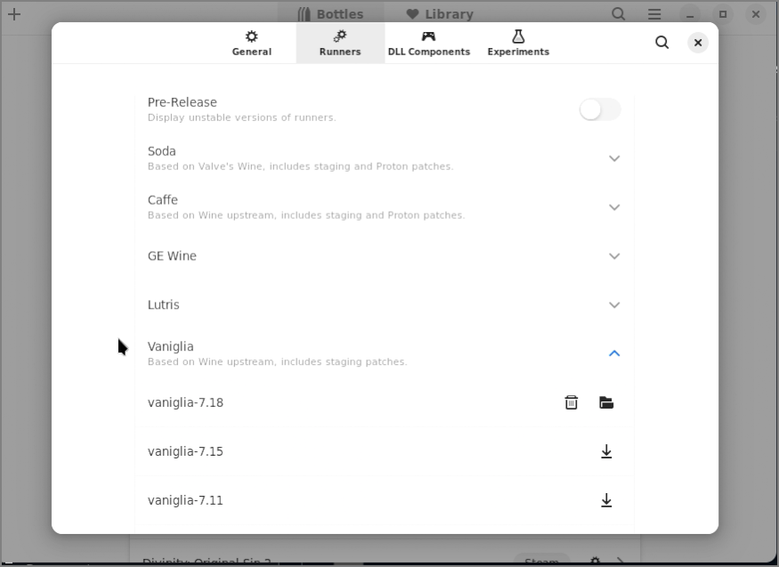 

Make sure you install the following Runners:

- Vaniglia-6.23

- Vaniglia-7.18

Now install the following DLL Components:

- DXVK: dxvk-1.9.4

- VKd3d: vkd3d-proton-2.5

  

### Making the custom bottle

Now we need to make our own custom bottle where we can host the game with all our mods.

To do this start by hitting the "+" button in the top left to make a new Bottle
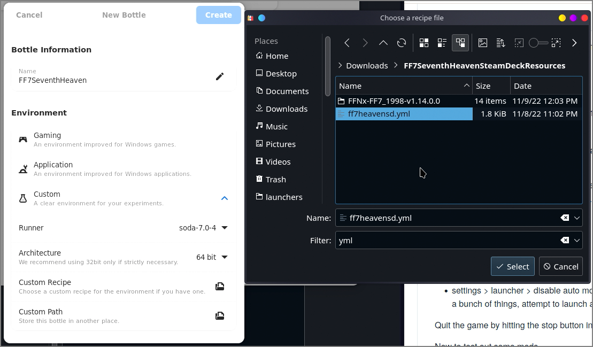  

Name it whatever you want but I like "FF7SeventhHeaven"

  

- Select custom in the environment type.

- Runner: soda-7.0.4

- Recipe: Custom Recipe

	- Point it at your custom recipe file we downloaded earlier ([ff7heavensd.yml](https://github.com/auntiepickle/ff7seventhheavensteamdeck/blob/main/ff7heavensd.yml))

  

(This will take a bit to configure so go get a cup of coffee, browse reddit, take a bio break, w/e...)

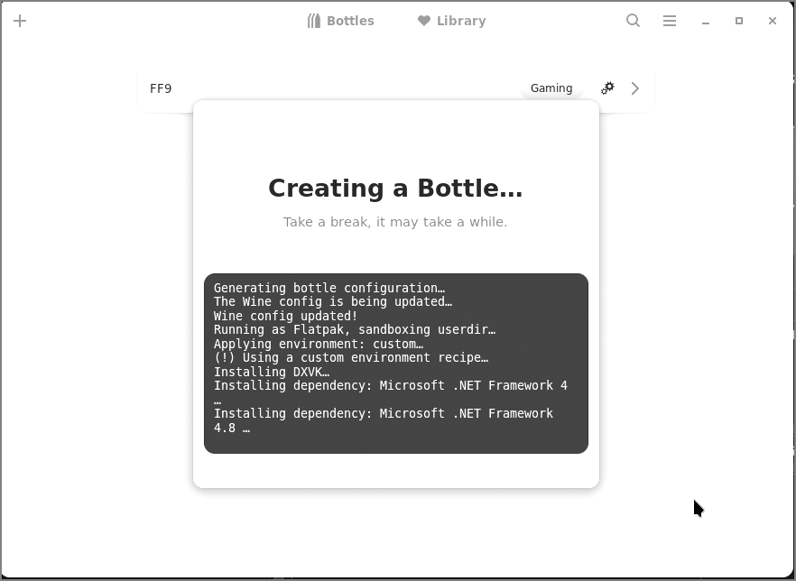    

Once it is done, go into the preferences tab of the newly created bottle and make sure the following options are set under System > Runner Components

- DXVK Version: dxvk-1.9.4

- XKD3D Version: vkd3d-proton-2.5

 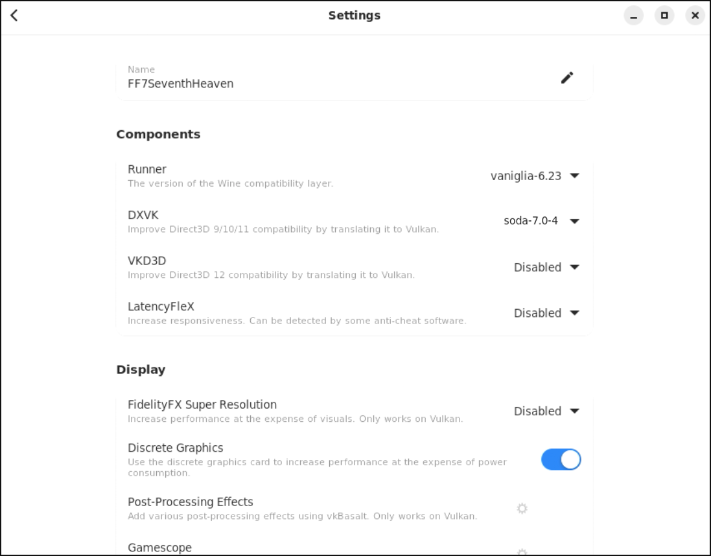  

### Installing 7th Heaven

Next we want to run the installer for 7th Heaven. To do this from within the selected `Bottle` select "Run Executable" and point it at the 7th Heaven installer we downloaded earlier

  

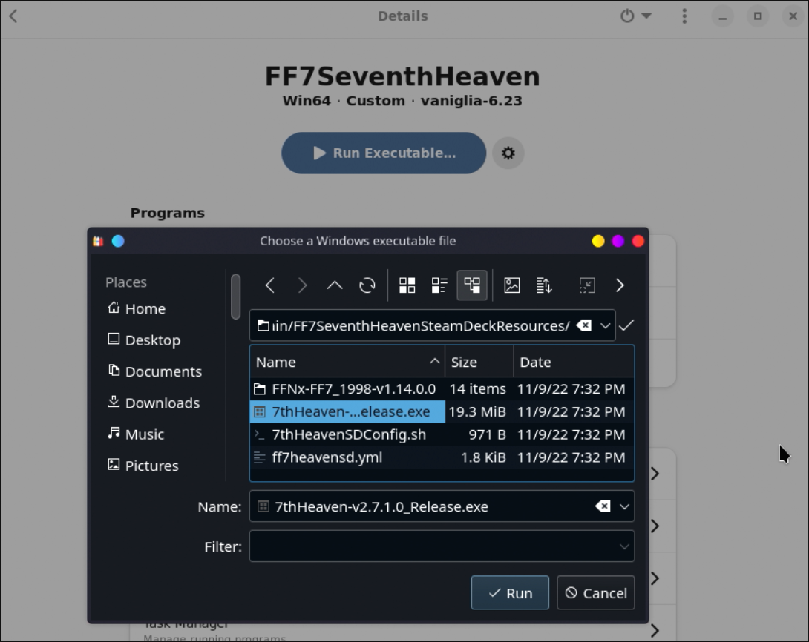

  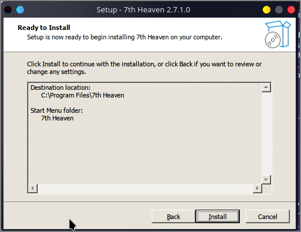

- Follow the default steps and it should launch!

- The screen will be black, this is OK,

- Close the app

  

*There is an issue where the UI renders black which will become a common theme but we'll solve it later*

### Adding some files and folders

The next step is to add some files and folders to allow 7th Heaven to work properly when we launch it next.

I will include each step below for completeness but, if you're like me and want a simple copy/paste. Here is a combined version of all the scripts below (modify it for your install paths if they differ)

(There is also a [shell script](https://github.com/auntiepickle/ff7seventhheavensteamdeck/blob/main/FF7SeventhHeavenSteamDeckResources/7thHeavenSDConfig.sh) which you can run if that's easier for you)

If you do this, feel free to skip to the **Configuring 7th Heaven** section below

```
ln -s ~/.local/share/Steam/steamapps/common/FINAL\ FANTASY\ VII ~/.var/app/com.usebottles.bottles/data/bottles/bottles/FF7SeventhHeaven/drive_c/FFVII_STEAM_FOLDER
printf 'FF7DISC1' > ~/.var/app/com.usebottles.bottles/data/bottles/bottles/FF7SeventhHeaven/drive_c/.windows-label
mkdir -p ~/.var/app/com.usebottles.bottles/data/bottles/bottles/FF7SeventhHeaven/drive_c/FFVII_STEAM_FOLDER/mods/{7thHeaven,textures}
cp -r ~/Downloads/ff7seventhheavensteamdeck-main/FF7SeventhHeavenSteamDeckResources/FFNx-FF7_1998-v1.14.0.0/* ~/.local/share/Steam/steamapps/common/FINAL\ FANTASY\ VII
mkdir ~/.var/app/com.usebottles.bottles/data/bottles/bottles/FF7SeventhHeaven/drive_c/Program\ Files/7th\ Heaven/Resources/Game\ Driver/
cp -r ~/Downloads/ff7seventhheavensteamdeck-main/FF7SeventhHeavenSteamDeckResources/FFNx-FF7_1998-v1.14.0.0/* ~/.var/app/com.usebottles.bottles/data/bottles/bottles/FF7SeventhHeaven/drive_c/Program\ Files/7th\ Heaven/Resources/Game\ Driver/
```

  

#### Hardlinking the game

Depending on where you've installed FFVII, the following command will differ....

  

**When using the Steam Deck's internal memory storage**, you will need to type the following:

  

```
ln -s ~/.local/share/Steam/steamapps/common/FINAL\ FANTASY\ VII ~/.var/app/com.usebottles.bottles/data/bottles/bottles/FF7SeventhHeaven/drive_c/FFVII_STEAM_FOLDER
```

  

Otherwise, **if you've installed Final Fantasy VII to an external storage (in this case, the inserted sd card)** the command will look like the following:

  

```
ln -s /run/media/mmcblk0p1/steamapps/common/FINAL\ FANTASY\ VII ~/.var/app/com.usebottles.bottles/data/bottles/bottles/FF7SeventhHeaven/drive_c/FFVII_STEAM_FOLDER
```

  

_To summarize, we are creating a symbolic link between our Final Fantasy VII Common directory and our bottle environment where we will run the executable. This way allows us to use our FF7 install.

  

Next we need to add a few files and folders to the 7th Heaven Folder to complete the config.

#### Adding a default drive label of `FF7DISC1` to our C Drive

  

```
printf 'FF7DISC1' > ~/.var/app/com.usebottles.bottles/data/bottles/bottles/FF7SeventhHeaven/drive_c/.windows-label
```

*This step adds the label "FF7DISC1" to your C Drive which avoids the issues where it looks for a disc and cannot find it.*

#### Adding some folders for 7th Heaven

7th Heaven stores some mod files in two different directories we will want to create ahead of time.

```
mkdir -p ~/.var/app/com.usebottles.bottles/data/bottles/bottles/FF7SeventhHeaven/drive_c/FFVII_STEAM_FOLDER/mods/{7thHeaven,textures}
```

#### Adding FFNx manually

This step is necessary because FFNx has issues getting its first download in my experience. I have gotten this to eventually download through the Bottle but it's not reliable and we will opt to just copy the files to stream line the configuration.

  

```
cp -r ~/Downloads/ff7seventhheavensteamdeck-main/FF7SeventhHeavenSteamDeckResources/FFNx-FF7_1998-v1.14.0.0/* ~/.local/share/Steam/steamapps/common/FINAL\ FANTASY\ VII
mkdir ~/.var/app/com.usebottles.bottles/data/bottles/bottles/FF7SeventhHeaven/drive_c/Program\ Files/7th\ Heaven/Resources/Game\ Driver/
cp -r ~/Downloads/ff7seventhheavensteamdeck-main/FF7SeventhHeavenSteamDeckResources/FFNx-FF7_1998-v1.14.0.0/* ~/.var/app/com.usebottles.bottles/data/bottles/bottles/FF7SeventhHeaven/drive_c/Program\ Files/7th\ Heaven/Resources/Game\ Driver/
```

Now it's show time and we can config 7th Heaven!

  
  

### Configuring 7th Heaven

To avoid the black screen, before launching 7th Heaven,

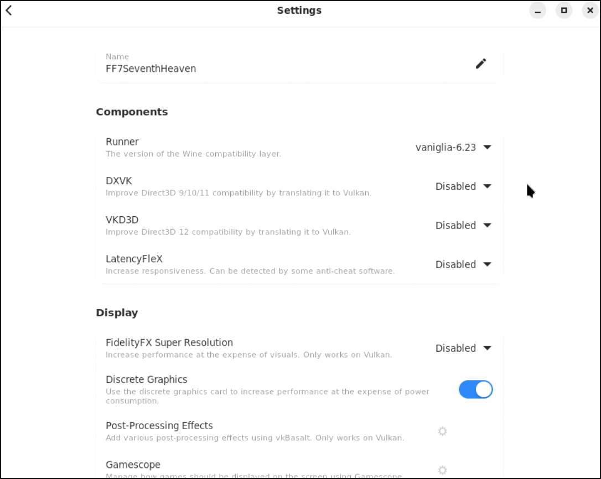

- Toggle the "Improve Direct 3D 9/10/11" setting

- Launch 7th Heaven

  

The next step of the installer will ask you about where FF7 is located.

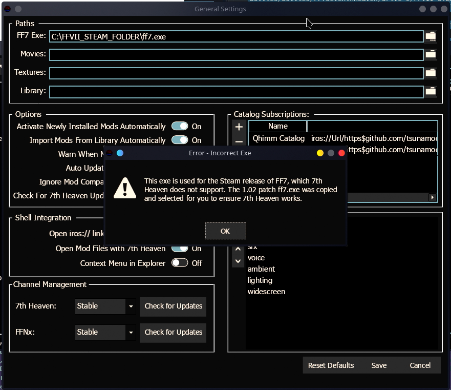  

- FF7 Exe: My Computer > FF7DISC1 > FFVII_STEAM > ff7_en.exe

	-  *This will throw an error and make a file called ff7.exe for you and point to it, which is correct*

- Movies: My Computer > FF7DISC1 > FFVII_STEAM > data > movies

- Textures: My Computer > FF7DISC1 > FFVII_STEAM > mods > textures

- Library: My Computer > FF7DISC1 > FFVII_STEAM > mods > 7thHeaven

- Hit **Save** 

Then modify the auto disk mount

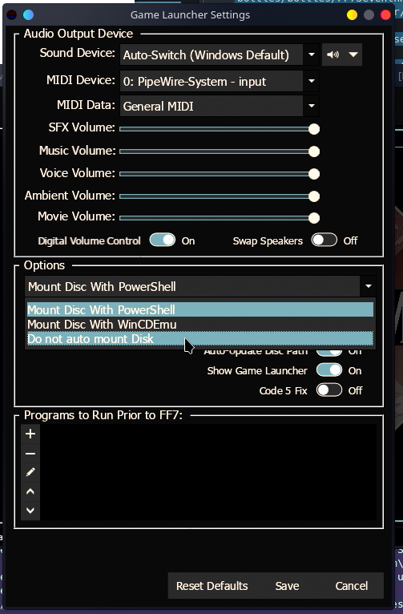

- Settings > Game Launcher > Options > **Do not auto mount Disk**

- Hit **Save**

Launch the game

- Hit the **Play** button.

  

At this point the game should config a bunch of things, launch, and display a red version of Eidos!

 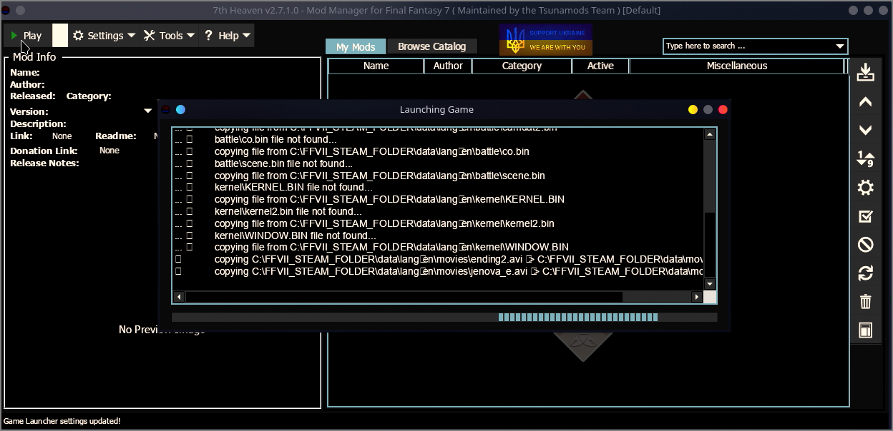 
  
 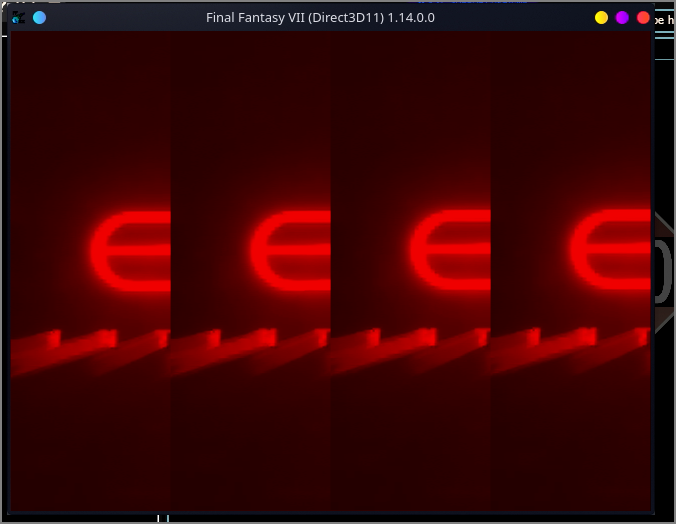

This means you have successfully enabled everything and can now move on to enabling some mods.

  

Quit the game by hitting the stop button in Bottles, or exiting out of the windows.

  


Now to test out some mods...

  

### Installing mods

- Change the launcher to **Vaniglia-7.18**

- Launch 7th Heaven

	- nothing should happen as it will silently crash (this was the only way I could get the runner we need to work working, odd workaround I know...)

- Change the runner to be "Vaniglia-6.23" runner

- Ensure "Improve Direct3D 9/10/11 Compatibility" is **disabled**

- Reboot `Bottles`


Now we can configure and download some mods!

  
  

- Launch 7th Heaven

- Install your mods (Browse Catalog tab)

  

I also suggest modifying the Game Driver now so you can get the native experience (optional)

- Settings > Game Driver > Graphics

	- Resolution: 1920x1080 (or whatever it shows)

	- Graphics API: DirectX 11

	- Window Mode: Borderless

	- Aspect Ratio: 16:9

- Advanced

	- Show Driver Version: Off

	- Show Graphics API: Off

- Hit Save

  

With all that done, we can try to run FF7 with mods by

- Closing 7th Heaven

- Turning on "Improve Direct3D 9/10/11 Compatibility"

- Reboot `Bottles`

	- (I do this just to be safe since sometimes it doesnt always pick up the config changes)

- Launch 7th Heaven

	- You'll likely notice black UI, thats why we turn this off and a necessary step to repeat as you config stuff and then try to play

- Hit Play

If things went to plan you should see FF7 loaded with your selected mods

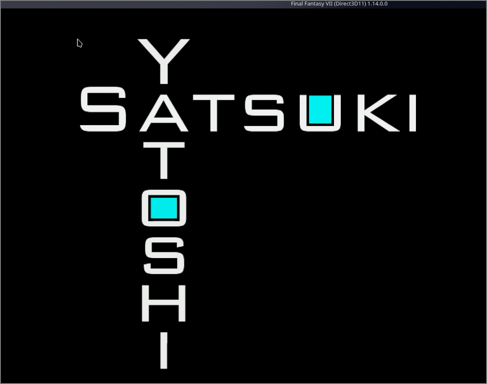
  

Whenever you want to configure your mods, toggle "Improve Direct3D 9/10/11 Compatibility":

- Turn off "Improve Direct3D 9/10/11 Compatibility",

- Reboot 7th Heaven,

- Configure 7th Heaven

- Quit 7th Heaven

- Turn on "Improve Direct3D 9/10/11 Compatibility"

- Restart 7th Heaven

- Hit Play

	-  *(If you don't see the black UI, I found I usually get a subsequent crash which can easily be solved by rebooting `Bottles`)*

  

And that's it! Now you can add Bottles to steam and spend the rest of your time in Gaming mode.

  

### Adding Bottles to steam 

The last step in our journey is to add bottles to our known steam apps. This way you can run FF7 from Gaming mode. 


To add Bottles, we need to add the Seventh Heaven Program manually in our Bottle
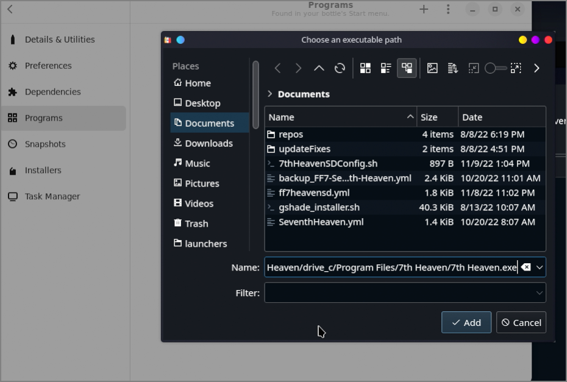

- Within the "Programs" section of our bottles hit the "+" button to add a manual reference to 7th Heaven
  - If you followed the default config, the path should be:
	```
	/home/deck/.var/app/com.usebottles.bottles/data/bottles/bottles/FF7SeventhHeaven/drive_c/Program Files/7th Heaven/7th Heaven.exe
	```
- A new entry will be added to your Programs list and we can now simply add a new game to steam
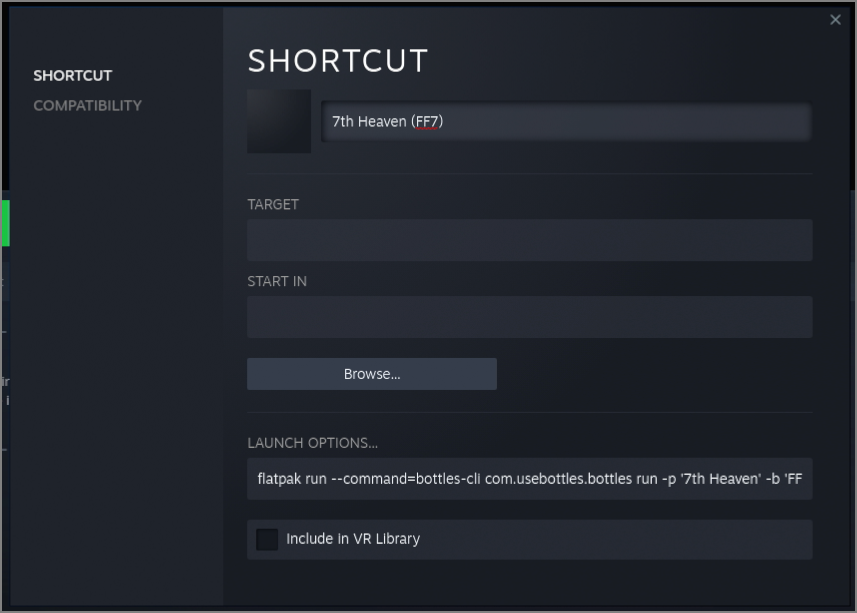

- Hit "Add a Game" in the bottom left corner of Steam
- Add a Non-Steam Game
- Select Bottles from the add a game list
- "Add Selected Programs"
- Now modify the Bottles entry
	- Right click Bottles in Steam
		- Properties
			- Rename the shortcut to your liking e.g. "7th Heaven (FF7)"
			- Remove the target and Start in fields
			- Add the following to LAUNCH OPTIONS
  				```
				flatpak run --command=bottles-cli com.usebottles.bottles run -p '7th Heaven' -b 'FF7SeventhHeaven'
				```

And that's it! Now you can hit play and you should see 7th Heaven running from Steam and in Gaming mode

Alternatively, if you plan to modify the mods inside of gaming mode, you can just add bottles as an entry like so:
```
flatpak run com.usebottles.bottles
```

## Looking for help

I would love any optimizations you figure out after following my guide. I don't claim for this to be perfect but I was able to consistently get 7th Heaven running from scratch by following the instructions in this guide.
 

Overall, I would say this process is really finicky but once I got everything up and running I didn't have anymore issues. I am hopeful with time many bug fixes can be applied in this space to make things a bit more smooth.

I think we could automate the file and config process a bit more with some shell scripts and would be interested to collaborate with anyone who wants to make improvements in this space.

## Common Issues

If you run into issues along the way I noticed a few things go wrong if I didn't follow the steps to a T, here are some things I found helpful to get things up and running

- Missing DotNet installs. I attempted to do this with Vaniglia as the default runner from the get go but for some reason Bottles does not play nicely with dependencies when not using soda. If you notice there is no Microsoft.Net folder in C:/windows, you likely need to restart the bottle config and make sure you have the right runner selected if you cannot get a clean boot of 7th heaven

- FF7 Crashing before mods are installed. It seems there is something going on with the ffnx files and the updater. You'll notice some errors and in general if I couldnt get a clean run of FF7 it was due to ffnx missing its components. You can check this within 7th Heaven hit the Settings > Game Driver and it should throw an error if it doesn't have FFNx files. This is why I added the steps to manually add FFNx since the downloader causes crashes when it fails and seems flaky